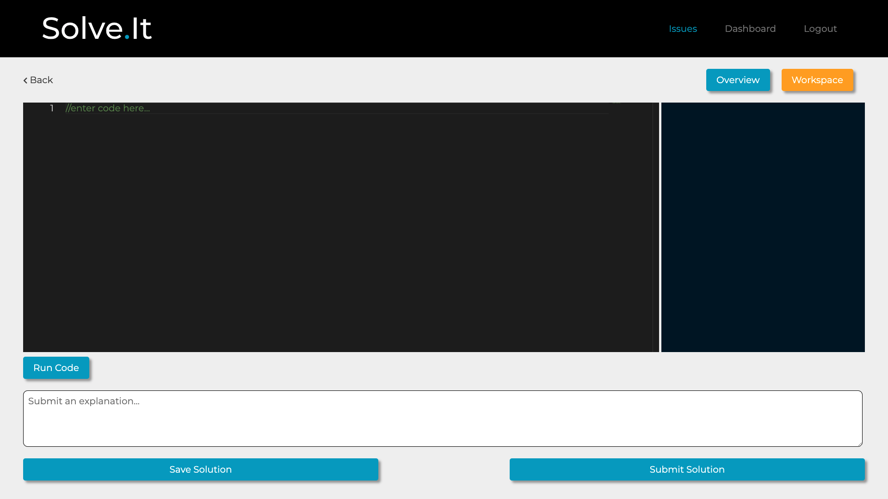
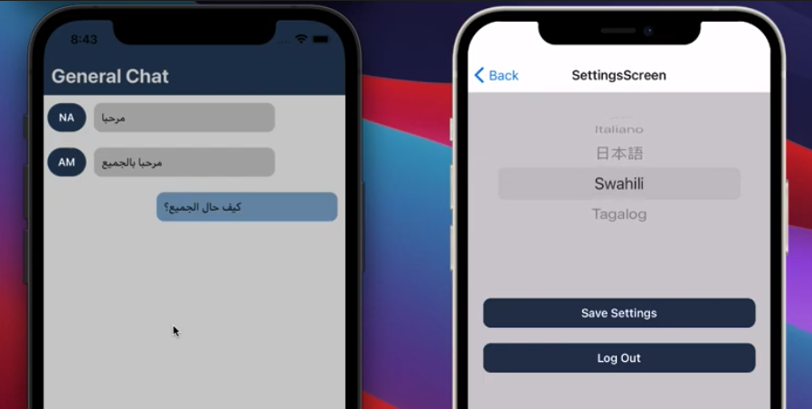

## Hello I'm Nathan
Im a software engineer with a love for technology and solving complex problems. Along with previous development experience, I have an educational background in computer science and am a graduate of Fullstack Academy. 

My go-to tech stack is fullstack javascript with React on the frontend and Node and Express with Postgres on the Backend.

I am always looking to learn new things, expand my knowledge and become a better developer. 

## Recent Projects
### [Solve.it](https://github.com/Team-Neptune-FSA/solve-it)
StackOverflow meets Fiverr. A place for posting coding issues with a monetary incentive for their resolution. A resource for finding quick and efficient solutions to your issues, and/or to make some money as a freelance debugger. Has a built in house IDE included, built with Docker and allowing users to write and run code within our application.

Tech Stack: React, Node/Express, Postres, Docker

 

### [ChatLingo](https://github.com/nathandamico5/chatLingo)
Realtime messaging app that allows users to send and recive messaging in a language of their choice, with messages automatically translated.

Tech Stack: React Native, Socket.io, Redux, Node/Express, Postgres, GoogleTranslateAPI

 

## Contact
Feel free to connect with me on [LinkedIn](https://www.linkedin.com/in/nathandamico/) or send me an email at <nathandamico5@gmail.com>.

<!--
**nathandamico5/nathandamico5** is a ✨ _special_ ✨ repository because its `README.md` (this file) appears on your GitHub profile.

Here are some ideas to get you started:

- 🔭 I’m currently working on ...
- 🌱 I’m currently learning ...
- 👯 I’m looking to collaborate on ...
- 🤔 I’m looking for help with ...
- 💬 Ask me about ...
- 📫 How to reach me: ...
- 😄 Pronouns: ...
- ⚡ Fun fact: ...
-->
